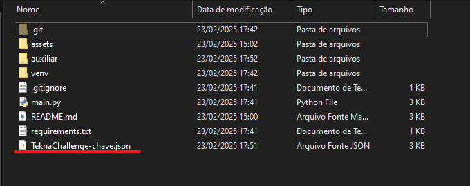
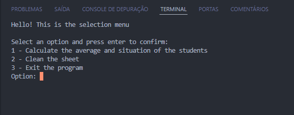

# ChallengeTekna

## Challenge description

This challenge requires to create an access to a google sheets database, then make manipulations on the columns so we can calculate the average grades of the students.

## 📌 Table of Contents
- [Challenge description](#challenge-description)
- [Guide to run the code](#guide-to-run-the-code)
  - [1 - Python installation](#1---python-installation)
  - [2 - Preparing the environment](#2---preparing-the-environment)
  - [3 - Credential Important](#3---credentials---important-)
  - [4 - Installing dependencies](#4---installing-dependencies)
  - [5 - Running the code](#5---running-the-code)
- [Credits and Contacts](#credits-and-contacts)

---

## Guide to run the code 

This project was developed using python 3 and some of their libraries, alogside with some google libraries so that we can access the google sheet.
Then following there is a guide to help you run the code.

Follow it step by step to prevent errors.

---

### 1 - Python installation

First we need to make sure that our engine is working. Check if python3 is installed in you computer, run this code on the terminal of your preference(i recommend git bash if you are on windows) :

``` bash
python3 --version
```

It should show something like :

```bash
Python 3.x.x
```

If it doesn't show anything like that, we need to install python. 

If you are on windows download python on the official Python website, click [here](https://www.python.org/downloads/) to access.

If you are on ubuntu you will be fine running these commands on you terminal :

```bash
sudo apt update && sudo apt upgrade -y
sudo apt install python3 python3-pip -y
```

Verify if both are correctly installed with these two commands :

```bash
python3 --version
pip --version
```

---

### 2 - Preparing the environment

We are gonna use venv to keep an isolate environment so we can install dependencies without setting them globally and our application can run smoothly.

On ubuntu run the code below to install venv :

```bash
sudo apt install python3-venv
```

> Note: On windows there is no need to install the `venv` package since it already comes along with the instalation of Python 3.3 and beyond.

Now to setup the environment on the command prompt of your preference, run the code:

Ubuntu (or git bash on windows) :
```bash
python3 -m venv venv
source venv/bin/activate
```

Windows (CMD or PowerShell):
```bash
python -m venv venv
venv\Scripts\activate
```

Windows (PowerShell alternativ):
```bash
venv\Scripts\activate.bat
```

Windows (git bash):
```bash
source venv/Scripts/activate
```

You should see something like `(venv)` before the path on your terminal indicating that the environment is active.

--- 

### 3 - CREDENTIALS - IMPORTANT !

Before installing dependencies, you need credentials for accessing the Google Sheet.

1. You will receive the `TeknaChallenge-chave.json` file via email.
2. Download and place it in the **root directory** of the project.
3. The structure should look like this:


 
 ---

### 4 - Installing dependencies

Before we run the code we need to make sure all of the dependencies used in the project are installed.

Luckily there is a requirement.txt in the root of the repository that you can run with the command :

```bash
pip install -r requirements.txt
```

---

### 5 - Running the code

Finally we can run the code after all of the setup, you can run the code with the command :

Windows:
```bash
python main.py
```

Ubuntu :
```bash
python3 main.py
```

It should show the menu for choosing the options of what you want to do with the project :  



After that you should choose the options for manipulating the sheet or leaving the menu, terminating the program.

---

## Credits and Contacts

This project was made by [João Victor Cavalcanti(me :D)](https://www.linkedin.com/in/joaovictorcavalcanti272105196/)

Feel free to contact me on my email : jvictorao123@gmail.com
